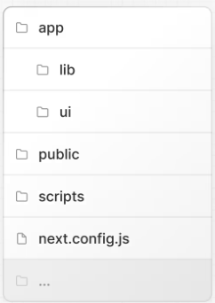
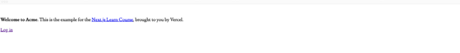

# 시작하기

패키지 관리자로 pnpm을 사용하는 게 npm 또는 yarn보다 빠르고 효율적입니다. 아래는 pnpm 설치 방법입니다.
```
npm install -g pnpm
```

**'Next.js learn with vercel'** 에 대한 앱을 만드려면, 
```
npx create-next-app@latest nextjs-dashboard --example "https://github.com/vercel/next-learn/tree/main/dashboard/starter-example" --use-pnpm
```

---

### 프로젝트의 폴더 구조


- /app : 애플리케이션의 모든 Route, Component, Logic을 포함하며, 대부분 이곳에서 작업하게 됩니다.
- /app/lib : 재사용 가능한 유틸리티 함수 및 데이터 가져오기 함수 등 애플리케이션에서 사용되는 함수를 포함합니다.
- /app/ui : 애플리케이션의 모든 ui를 포함합니다. 
- /public : 애플리케이션의 모든 정적 에셋이 들어있습니다.
- /next.config.js : 이 파일을 수정할 필요는 없습니다.


**/app/lib/placeholder-data.ts에 모든 목 데이터가 있습니다. 또한 모든 파일은 ts 또는 tsx로 작성 되었습니다.**

---

### 개발 서버 실행

pnpm i를 실행하여 프로젝트의 패키지를 설치합니다.
```
pnpm i
```

이어서 pnpm dev를 입력하면, 개발 서버가 시작됩니다.
```
pnpm dev
```

**pnpm dev는, 포트 3000에서 Next.js 개발 서버를 시작합니다.**

다음과 같은 모습이 나오면 1챕터를 완료한 것입니다.



