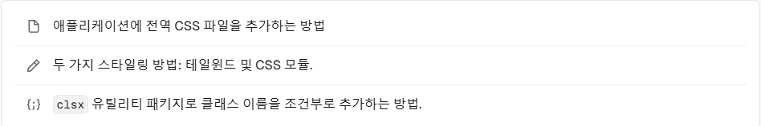
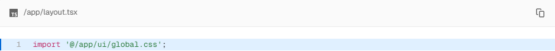
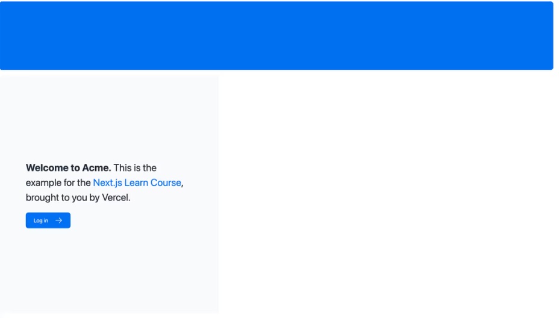
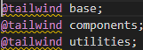

# CSS 스타일링 ✏️

### 이 장에서 다룰 주제는 다음과 같습니다. (현재 프로젝트에 CSS가 없습니다.)


---

### 글로벌 스타일

Next.js에서 한 파일로 모든 컴포넌트에 CSS를 적용하고 싶다면, 다음과 같이 해주세요 :

1. global.css를 루트 레이아웃인 layout.tsx에 임포트


2. 저장한 후, 홈페이지가 다음과 같이 보이면 정상입니다.


*😑 흠, CSS 규칙을 추가하지 않았는데 스타일은 어디에서 온걸까요?*
- 정답은 @tailwind 주석에 있습니다.



---

### 🔥 잠깐, Tailwind란 무엇인가요?

TSX 마크업에서 직접 유틸리티 클래스를 빠르게 작성할 수 있어 개발 프로세스 속도를 높일 수 있는 CSS 프레임워크입니다.

이렇게, 클래스 이름으로 바로 CSS 속성을 지정하여 사용할 수 있는 프레임워크입니다!
```tsx
<h1 className="text-blue-500">I'm blue!</h1>
```

create-next-app을 적용하는 과정에서 Tailwind 사용 여부를 여쭤 보고, Yes를 입력하면 이에 관해 필요한 패키지를 자동으로 설치하니 걱정 마세요!

끝의 문제는 비밀로 남겨두겠습니다. 😀

---

### CSS 모듈
**기존 CSS 규칙을 작성하거나, 스타일을 TSX와 별도로 유지하는 것을 선호하는 경우에 훌륭한 대안이 될 수 있습니다.**
