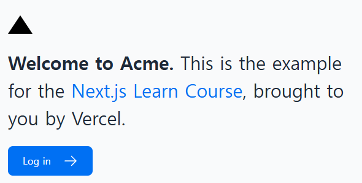

# CSS 스타일링 ✏️

### 이 장에서 다룰 주제는 다음과 같습니다. (현재 프로젝트에 CSS가 없습니다.)


---

### 글로벌 스타일

Next.js에서 한 파일로 모든 컴포넌트에 CSS를 적용하고 싶다면, 다음과 같이 해주세요 :

1. global.css를 루트 레이아웃인 layout.tsx에 임포트
   

2. 저장한 후, 홈페이지가 다음과 같이 보이면 정상입니다.
   

_😑 흠, CSS 규칙을 추가하지 않았는데 스타일은 어디에서 온걸까요?_

- 정답은 @tailwind 주석에 있습니다.


---

### 🔥 잠깐, Tailwind란 무엇인가요?

TSX 마크업에서 직접 유틸리티 클래스를 빠르게 작성할 수 있어 개발 프로세스 속도를 높일 수 있는 CSS 프레임워크입니다.

이렇게, 클래스 이름으로 바로 CSS 속성을 지정하여 사용할 수 있는 프레임워크입니다!

```tsx
<h1 className="text-blue-500">I'm blue!</h1>
```

create-next-app을 적용하는 과정에서 Tailwind 사용 여부를 여쭤 보고, Yes를 입력하면 이에 관해 필요한 패키지를 자동으로 설치하니 걱정 마세요!

끝의 문제는 비밀로 남겨두겠습니다. 😀

---

### CSS 모듈

**기존 CSS 규칙을 작성하거나, 스타일을 TSX와 별도로 유지하는 것을 선호하는 경우에 훌륭한 대안이 될 수 있습니다.**

_CSS 모듈을 사용하면, 고유한 클래스 이름을 자동으로 생성하여 CSS의 범위를 컴포넌트에 한정할 수 있으므로 스타일 충돌에 대해 걱정할 필요가 없습니다._

💢 CSS 모듈 맛보기

1. /app/ui에 home.module.css라는 새 파일을 생성하고 다음 CSS 규칙을 추가합니다.

```css
.shape {
  height: 0;
  width: 0;
  border-bottom: 30px solid black;
  border-left: 20px solid transparent;
  border-right: 20px solid transparent;
}
```

2. 그런 다음 /app/page.tsx에서 아까 추가한 div 스타일을 이렇게 바꿉니다.

```tsx
import AcmeLogo from '@/app/ui/acme-logo';
import { ArrowRightIcon } from '@heroicons/react/24/outline';
import Link from 'next/link';
import styles from '@/app/ui/home.module.css';

export default function Page() {
  return (
    <main className="flex min-h-screen flex-col p-6">
      <div className={styles.shape} />
    // ...
  )
}
```

3. 서버를 시작하여 화면을 확인해 삼각형이 그대로 존재하는지 확인합니다.
   

---

### 클래스 이름을 조건에 따라 토글하고 싶지 않나요!? 😠

**clsx 라이브러리를 이용하여 클래스 이름 토글하기**

clsx는 상태나 조건에 따라 클래스 이름을 쉽게 전환시켜 주는 라이브러리입니다.

```tsx
// in status.tsx
import clsx from 'clsx';

export default function InvoiceStatus({ status }: { status: string }) {
  return (
    <span
      className={clsx(
        'inline-flex items-center rounded-full px-2 py-1 text-sm',
        {
          'bg-gray-100 text-gray-500': status === 'pending',
          'bg-green-500 text-white': status === 'paid',
        },
      )}
    >
    // ...
)}
```
