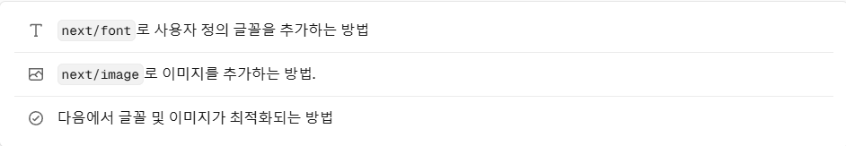
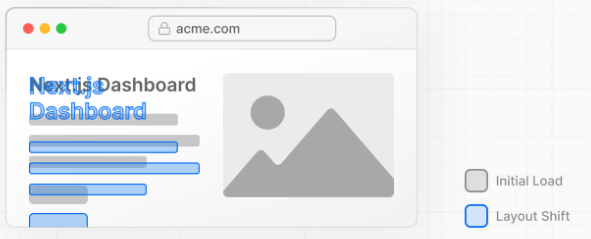

# 글꼴 및 이미지 최적화하기

### 이 장에서 다룰 주제는 3개입니다! 💪


---

### 그 전에, 글꼴을 최적화할 필요가 있을까요?? 🤔
1. *프로젝트에서 사용자 정의 글꼴을 사용하면, 글꼴 파일을 가져와 로드해야 하는 경우, 성능에 영향을 줄 수 있습니다.*
2. *브라우저가 처음에 폴백 또는 시스템 글꼴로 텍스트를 렌더링한 다음, 로드된 후 사용자 정의 글꼴로 교체할 때 레이아웃이 변경되어 주변의 요소가 이동하여 사용자 경험을 해칠 수 있습니다.*



### 어떻게 해결해야 하죠? 🥹
걱정 마세요. Next.js는 next/font 모듈을 사용할 때, 애플리케이션의 글꼴을 자동으로 최적화합니다! 빌드 시점에 글꼴 파일을 다운로드하여 다른 정적 에셋과 함께 호스팅합니다. 런타임이 아닌 '빌드' 시점에요~~

---

### 기본 글꼴 추가하기 (Google 글꼴 사용)

1. /app/ui 폴더에 fonts.ts라는 새 파일을 생성합니다. 이 파일을 사용하여 애플리케이션 전체에서 사용할 글꼴을 보관합니다. 여기에 next/font/google 모듈에서 가져온 Inter 글꼴을 임포트하여 보관할 것입니다.
```ts
import { Inter } from 'next/font/google';
 
export const inter = Inter({ subsets: ['latin'] });
```
2. 그리고, layout.tsx의 body 태그에 폰트를 추가합니다! (루트 컴포넌트기에)
```tsx
import '@/app/ui/global.css';
import { inter } from '@/app/ui/fonts';
 
export default function RootLayout({
  children,
}: {
  children: React.ReactNode;
}) {
  return (
    <html lang="en">
      <body className={`${inter.className} antialiased`}>{children}</body>
    </html>
  );
}
```
3. 적용된 모습을 확인해야 하는데, 무엇이 바뀐 건지 잘 모르겠네요... 🥲 서브 미션에서는 확인 가능합니다! 이를 해결하면 AcmeLogo 활성화 과정에서 에러가 없을 것입니다. 해결해 보세요~!

---

### 이미지를 최적화하는 이유는❓

Next.js는 이미지와 같은 정적 자산을, /public 폴더 아래에 제공할 수 있죠? 

그런데 이를 스스로 최적화하여 적용하려면. . .
1. 이미지가 다양한 화면 크기에서 반응하는지 확인하고,
2. 다양한 디바이스에 맞는 이미지 크기를 지정하고ㅡ,ㅡ,,,
3. 이미지가 로드될 때 레이아웃 이동을 방지합니다.
4. 사용자 뷰포트 외부에 있는 이미지를 지연 로드하는 것까지~

**하지만, Next.js는 이 4가지 최적화 과정을, next/image 컴포넌트를 사용하기만 해도 자동으로 적용해 줍니다.**

### 😪

&lt;Image&gt;컴포넌트가 바로 next/image 컴포넌트입니다. html img 태그의 확장이며, 위 4가지 최적화 과정을 진행해 줍니다.

---

### 데스크톱 히어로 이미지 추가하기

1. /app/page.tsx 파일에서 next/image 컴포넌트를 가져오고, 주석 아래에 이미지를 추가합니다 :
```tsx
import AcmeLogo from '@/app/ui/acme-logo';
import { ArrowRightIcon } from '@heroicons/react/24/outline';
import Link from 'next/link';
import { lusitana } from '@/app/ui/fonts';
import Image from 'next/image';
 
export default function Page() {
  return (
    // ...
    <div className="flex items-center justify-center p-6 md:w-3/5 md:px-28 md:py-12">
      {/* Add Hero Images Here */}
      <Image
        src="/hero-desktop.png"
        width={1000}
        height={760}
        className="hidden md:block"
        alt="Screenshots of the dashboard project showing desktop version"
      />
    </div>
    //...
  );
}
```
**여기에서, 본래 이미지 비율과 동일한 픽셀로 가로 세로를 반드시 설정해 주어야 합니다! 그래야 레이아웃 이동이 일어나지 않아요.**


