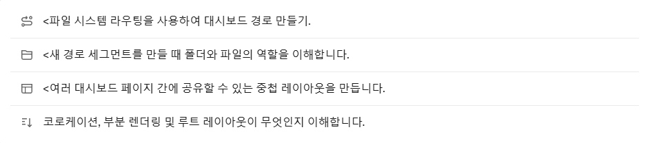

# 레이아웃 및 페이지 만들기
*지금까지의 우리 애플리케이션은 홈 페이지만 다뤄 왔는데, 더 나아가 레이아웃 및 페이지를 사용하여 더 많은 경로를 만드는 방법을 알아보고 싶으시군요! 시작해봅시다.* 🤣

### 이 장에서는, 4가지 주제가 있습니다!

---

### 중첩 라우팅 💢

Next.js는 신기하게도, 파일 시스템 라우팅을 사용하여 중첩된 경로를 만드는 데 **폴더**를 사용한다네요. 각 폴더는 경로 영역에 매핑되는 URL 영역을 나타냅니다!

