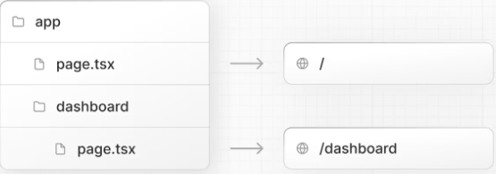
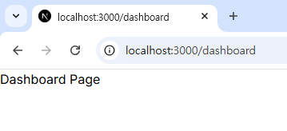
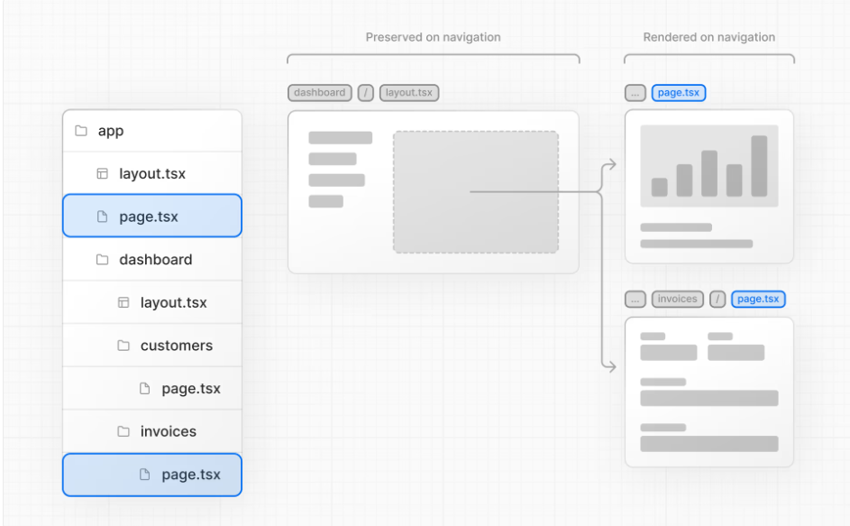

# 레이아웃 및 페이지 만들기
*지금까지의 우리 애플리케이션은 홈 페이지만 다뤄 왔는데, 더 나아가 레이아웃 및 페이지를 사용하여 더 많은 경로를 만드는 방법을 알아보고 싶으시군요! 시작해봅시다.* 🤣

### 이 장에서는, 4가지 주제가 있습니다!


---

### 중첩 라우팅 💢

- Next.js는 신기하게도, 파일 시스템 라우팅을 사용하여 중첩된 경로를 만드는 데 **폴더**를 사용한다네요. 각 폴더는 경로 영역에 매핑되는 URL 영역을 나타냅니다!

- *layout.tsx 및 page.tsx 파일을 사용하여 각 경로에 대한 별도의 ui를 만들 수 있습니다.*

- page.tsx는 React 컴포넌트를 내보내는 특별한 Next.js 파일이며, 경로에 액세스하려면 이 파일이 필요합니다. 현재 만든 1개의 page.tsx는 '/' 경로에 매핑되어 있습니다.

중첩된 경로를 만드려면, 폴더를 서로 중첩하고 그 안에 page.tsx 파일을 추가하기만 하면 됩니다. 참 쉽네요 😒 그럼 시작해볼까요?



위 사진과 같이, /app/dashboard/page.tsx를 만들어서 /dashboard 경로에 연결해 봅시다!

---

### 대시보드 페이지 만들기 🔥

1. /app 내에 dashboard 폴더를 만듭니다. 그런 다음, dashboard 폴더 안에 다음 내용으로 새 page.tsx 파일을 만들어요 :
```tsx
export default function Page() {
  return <p>Dashboard Page</p>;
}
```
2. 잠깐 로컬 서버를 실행하여 /dashboard 페이지로 이동하고, Dashboard Page 텍스트가 원활하게 표시되는지 확인합니다.



3. 지금까지 배운 개념을 바탕으로, http://localhost:3000/dashboard/customers 페이지에서 Customers Page 텍스트가 뜨도록 해보시고, http://localhost:3000/dashboard/invoices 에서 Invoices Page 텍스트가 뜨도록 해보세요!

---

### 대시보드 레이아웃 만들기 🤔

대시보드에는 일종의 탐색 기능을 만들 겁니다. Next.js에서 layout.tsx, 이를 이용하여 여러 페이지 간에 공유되는 UI를 만들 수 있습니다!

/dashboard 폴더에 layout.tsx 파일을 추가하고, 다음 코드를 붙여 넣어 보세요 :
```tsx
import SideNav from '@/app/ui/dashboard/sidenav';
 
export default function Layout({ children }: { children: React.ReactNode }) {
  return (
    <div className="flex h-screen flex-col md:flex-row md:overflow-hidden">
      <div className="w-full flex-none md:w-64">
        <SideNav />
      </div>
      <div className="flex-grow p-6 md:overflow-y-auto md:p-12">{children}</div>
    </div>
  );
}
```

**Next.js에서 레이아웃을 사용하면, 탐색 시 페이지 구성 요소만 업데이트되고 레이아웃은 다시 렌더링되지 않는 이점이 있는데, 이를 부분 렌더링이라고 합니다. 아래 이미지를 보며 이해해 보세요!**



*/app/layout.tsx는 루트 레이아웃이라고 하며, 필수입니다. 루트 레이아웃에 추가하는 모든 UI는 애플리케이션의 모든 페이지에서 공유됩니다! 이를 사용하여 html 태그나 body 태그를 수정하고 메타 데이터를 추가할 수 있습니다.*