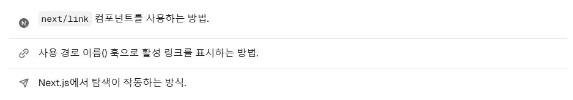

# 페이지 간 탐색 (a 태그 아님)

이제, 사용자가 대시보드 경로를 탐색할 수 있도록 몇 가지 링크를 추가해 봅시다.

### 이 장에서 다룰 주제는 3가지 입니다!


---

### 탐색을 최적화하는 이유? 💭
이전 챕터에서 추가한 사이드바 링크는 &lt;a&gt; 태그로 구성되어 있습니다. 페이지를 이동할 때마다 어떤 효과가 발생하는지 유심히 살펴보시면, . . .
<br>
🌨️<br>
❄️<br>
🏔️<br>
각 페이지 탐색에 전체 페이지 새로고침이 있습니다!

### 링크 컴포넌트 🔗
Next.js에서 Link Component를 사용하여, 애플리케이션의 페이지 간에 링크할 수 있습니다! 이는 자바스크립트로 클라이언트 사이드 탐색을 수행할 수 있게 해줍니다.

1. /app/ui/dashboard/nav-links.tsx의 a 태그를 이렇게 바꿔 봅시다.
```tsx
import {
  UserGroupIcon,
  HomeIcon,
  DocumentDuplicateIcon,
} from '@heroicons/react/24/outline';
import Link from 'next/link';
 
// ...
 
export default function NavLinks() {
  return (
    <>
      {links.map((link) => {
        const LinkIcon = link.icon;
        return (
          <Link
            key={link.name}
            href={link.href}
            className="flex h-[48px] grow items-center justify-center gap-2 rounded-md bg-gray-50 p-3 text-sm font-medium hover:bg-sky-100 hover:text-blue-600 md:flex-none md:justify-start md:p-2 md:px-3"
          >
            <LinkIcon className="w-6" />
            <p className="hidden md:block">{link.name}</p>
          </Link>
        );
      })}
    </>
  );
}
```

2. 다시 로컬 서버로 구동한 사이트에 접속하여 확인해 보면, 전체 새로고침이 없는 것을 확인하실 수 있습니다.

---

### 자동 코드 분할 및 프리페칭

탐색 환경을 개선하기 위해, Next.js는 경로 영역 별로 애플리케이션을 자동으로 코드 분할합니다. 이는 브라우저가 초기 로드 시 모든 애플리케이션 코드를 로드하는 기존의 React SPA와는 다릅니다.

경로별로 코드를 분할하면, 페이지가 격리되기 때문에 특정 페이지에서 오류가 발생해도 나머지 애플리케이션은 멀쩡합니다~~! ⚽

또한 브라우저의 뷰포트(보여지는 화면 영역)에 링크 컴포넌트가 나타날 때마다 백그라운드에서 링크된 경로를 프리페치하기 때문에, 페이지 전환이 거의 즉시 이루어집니다.

---

### 패턴 : 활성 링크 표시

일반적인 UI 패턴은, 활성 링크를 표시하여 사용자의 현재 웹사이트의 어떤 페이지에 위치했는지 알려주는 것입니다. 이렇게 하려면 URL에서 현재 사용자의 위치를 가져와야 하는데, Next.js는 usePathname() 훅을 제공하여 이를 도와줍니다.

훅은 클라이언트 컴포넌트(클라이언트 단에서 작동하는 컴포넌트)에서 작동하죠. 

1. usePathname을 next/navigation에서 가져오는데, 그 위에 "use client" 지시어를 추가합니다 :
```tsx
// in nav-links.tsx
'use client';
 
import {
  UserGroupIcon,
  HomeIcon,
  InboxIcon,
} from '@heroicons/react/24/outline';
import Link from 'next/link';
import { usePathname } from 'next/navigation';
 
// ...
```

2. 다음으로, 컴포넌트 안에 const pathname = usePathname();을 추가합니다.
```tsx
export default function NavLinks() {
  const pathname = usePathname();
  // ...
}
```

3. 앞전에 배운 clsx 라이브러리로 클래스 이름 토글을 수행합니다. 최종 코드입니다.
```tsx
'use client';
 
import {
  UserGroupIcon,
  HomeIcon,
  DocumentDuplicateIcon,
} from '@heroicons/react/24/outline';
import Link from 'next/link';
import { usePathname } from 'next/navigation';
import clsx from 'clsx';
 
// ...
 
export default function NavLinks() {
  const pathname = usePathname();
 
  return (
    <>
      {links.map((link) => {
        const LinkIcon = link.icon;
        return (
          <Link
            key={link.name}
            href={link.href}
            className={clsx(
              'flex h-[48px] grow items-center justify-center gap-2 rounded-md bg-gray-50 p-3 text-sm font-medium hover:bg-sky-100 hover:text-blue-600 md:flex-none md:justify-start md:p-2 md:px-3',
              {
                'bg-sky-100 text-blue-600': pathname === link.href,
              },
            )}
          >
            <LinkIcon className="w-6" />
            <p className="hidden md:block">{link.name}</p>
          </Link>
        );
      })}
    </>
  );
}
```